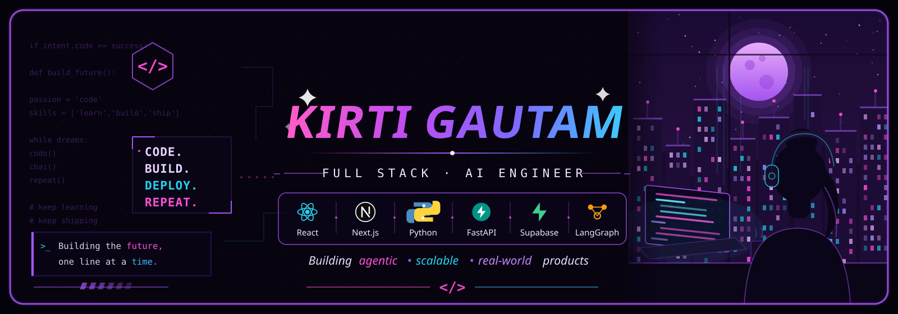

<p align="center">
  
</p> 
  
</h4>


<a href="https://git.io/typing-svg"></a>


<div align="center">
  
  
  
</div>


<h2 align="left">About me</h2>


<p>
👩‍💻 Computer Science (AI/ML) student at NST-ADYPU, Pune. <br>
🚀 Developer Intern, building full-stack applications and backend systems. <br>
🧠 Exploring AI/ML, LLMs, LangGraph, and intelligent applications. <br>
⚡ Working with React, Next.js, Node.js, TypeScript, Supabase & PostgreSQL. <br>
🧩 Currently sharpening my DSA, problem-solving, and system design skills. <br>
🎨 I like building things that are not only functional, but also look good. <br>
✉️ Connect: <a href="mailto:gautamkirti620@gmail.com">gautamkirti620@gmail.com</a>
</p>

###

<h2 align="left">I Code With</h2>

###

<h3 align="left">💻 Programming Languages</h3>
<p align="center">
  <a href="https://skillicons.dev">
    
  </a>
</p>

###

<h3 align="left">🎨 Frontend Development</h3>
<p align="center">
  <a href="https://skillicons.dev">
    
  </a>
</p>

###

<h3 align="left">🧩 Frameworks & Libraries</h3>
<p align="center">
  <a href="https://skillicons.dev">
    
  </a>
</p>

###

<h3 align="left">⚙️ Backend Development</h3>
<p align="center">
  <a href="https://skillicons.dev">
    
  </a>
</p>

###

<h3 align="left">🗄️ Databases</h3>
<p align="center">
  <a href="https://skillicons.dev">
    
  </a>
</p>

###

<h3 align="left">🤖 AI / Agents</h3>
<p align="center">
  
  
  
  
  
</p>

###

<h3 align="left">🛠️ Tools & Platforms</h3>
<p align="center">
  <a href="https://skillicons.dev">
    
  </a>
</p>

###

<h2 align="left">Connect with me</h2>

###

<div align="left">
  <a href="https://www.linkedin.com/in/kirtigautam620/" target="_blank">
    
  </a>
  <a href="mailto:gautamkirti620@gmail.com" target="_blank">
    
  </a>
</div>

###

<h2 align="left">📊 GitHub Stats:</h2>


<p align="center">
  
</p>

###

<br/>

<picture>
  <source media="(prefers-color-scheme: dark)" srcset="https://raw.githubusercontent.com/KirtiGautam620/KirtiGautam620/output/github-contribution-grid-snake-dark.svg">
  
</picture>

<br clear="both">


<h4 align="center">
  
```diff
+@ @ @ @ @ @ @ @ @ @ @ @ @ @ @ @ @ @ @ @ @ @ @ @ @ @ @ @+
@@                                                     @@
@@                                                     @@
@@          I ask too many questions and then          @@
@@                go find out myself                   @@
@@                                                     @@
@@          .-------------------------------.          @@
@@         |  while (curious) { build(); }   |         @@
@@          '-------------------------------'          @@
@@                                                     @@
@@                Easily obsessed.                     @@
@@                 Rarely bored. ✨                     @@
@@                                                     @@
+@ @ @ @ @ @ @ @ @ @ @ @ @ @ @ @ @ @ @ @ @ @ @ @ @ @ @ @+
```

</h4>
